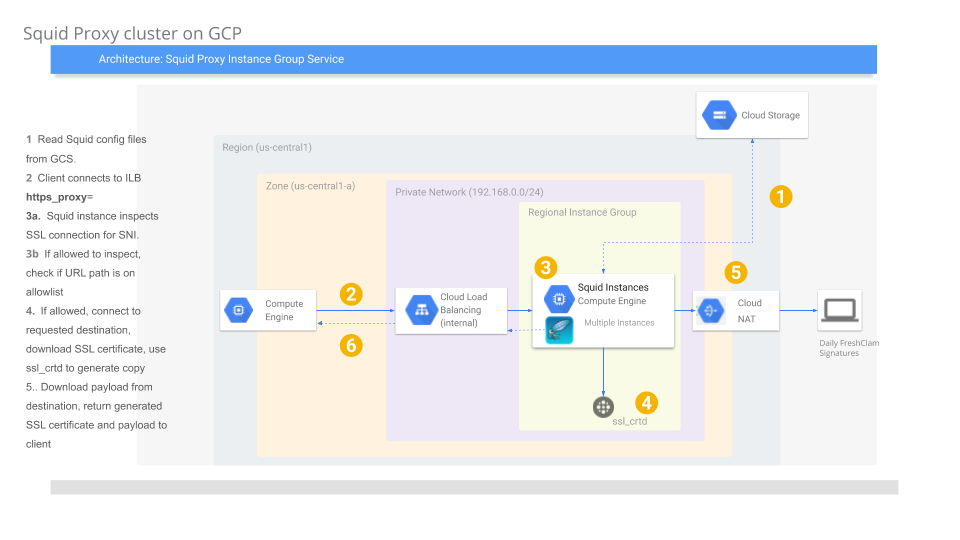
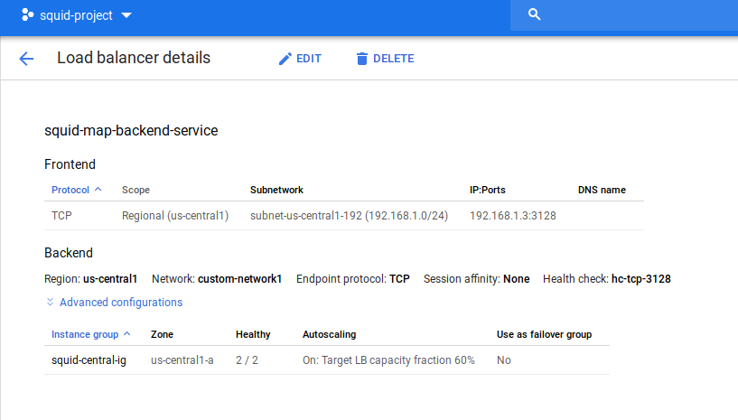
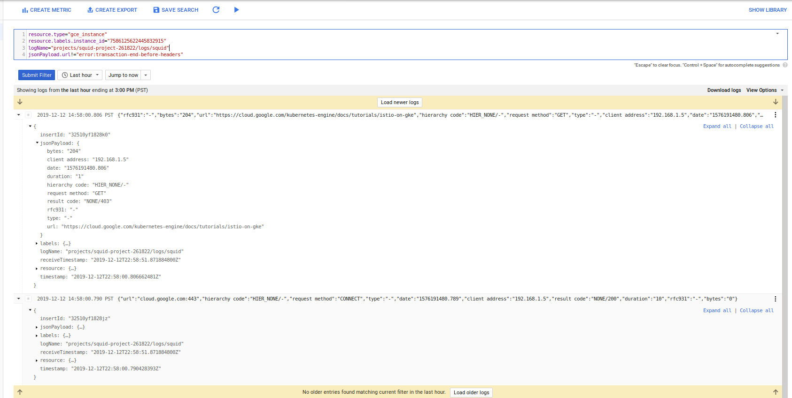

# Squid proxy cluster with ssl_bump on Google Cloud

Basic [squid proxy](http://www.squid-cache.org/) cluster which supports SSL inspection (`ssl_bump`).

The usecase for this is to inspect outbound ssl traffic originating from instances that specify the squid cluster as the `http_proxy` for outbound traffic.

That is, with this configuration, an administrator can inspect the actual data within an SSL stream
(i.,e allow `https://www.google.com/foo`  but not `https://www.google.com/bar` and see headers, payload, etc).

This is achieved by using squid's `ssl_bump` feature and delegating allow/deny decisions to a separate process that honors the [ICAP](https://wiki.squid-cache.org/Features/ICAP) protocol.


Use this setup to crate a cluster of squid proxies which:

* Runs as an auto-scaled [Managed Instance Group](https://cloud.google.com/compute/docs/instance-groups/)
* Runs the MIG in its own Google Cloud VPC network(https://cloud.google.com/vpc/)
* Each VM which runs squid does _not_ have external IPs and must traverse [Cloud NAT](https://cloud.google.com/nat/docs/overview)
* Supports [Dynamic SSL Certificate Generation](https://wiki.squid-cache.org/Features/DynamicSslCert)
* Squid VMs uses dedicated ServiceAccount  GCS Configuration bucket and has permissions to decrypt its private SSL certificate ACL protected and accessed through [Cloud Secrets](https://cloud.google.com/secret-manager/docs/)
* Proxy blocks access to host+paths that match enteries in a blacklist
* Proxy does not inspect traffic that match an SNI whitelist
* Squid access logging sent to [Google Stackdriver Logging](https://cloud.google.com/logging/) as structured content
* Squid VMs telemetry sent to [Google Cloud Stackdriver](https://cloud.google.com/monitoring/)




>> NOTE: this just a SAMPLE and __not__ supported by Google.  caveat emptor


If you use this setup, you **MUST** secure the service account, instance template and GCS bucket used by the cluster.  Any client that you want to monitor must direct  :443 traffic outbound towards the proxy.

...ofcourse, this is not a _transparent_ proxy configuration:  each client must honor proxy `CONNECT` protcol (eg, use `http_proxy=` directive)

---

## Setup

1. Setup some env-vars:

```bash
export GOOGLE_PROJECT_ID=`gcloud config get-value core/project`
export GOOGLE_PROJECT_NUMBER=`gcloud projects describe $GOOGLE_PROJECT_ID --format="value(projectNumber)"`
export BUCKET_SRC=$GOOGLE_PROJECT_ID-squid-src
export REGION=us-central1
export ZONE=us-central1-a
export GCE_SERVICE_ACCOUNT=gce-svc-account@$GOOGLE_PROJECT_ID.iam.gserviceaccount.com
```

2. Create the GCS Bucket o keep the configuation

```
gsutil mb gs://$BUCKET_SRC
```

3. Enable some APIs

```
gcloud services enable oslogin.googleapis.com iap.googleapis.com secretmanager.googleapis.com
```

4.  Generate the squid binary

Squid proxies by default do _not_ support `ssl_bump`.  The `Dockerfile` provided in this repo compiles squid with `ssl_bump` and dynamic certificate generation

```
docker build -t docker_tmp .
docker cp `docker create docker_tmp`:/apps/squid .
tar cvf squid.tar squid/
```

5. Copy the squid binary file to the GCS bucket

```
gsutil cp squid.tar gs://$BUCKET_SRC/
rm -rf squid.tar squid/

cd data/
gsutil cp  -r . gs://$BUCKET_SRC/data/
gsutil ls gs://$BUCKET_SRC/
```


6. Save private key into Google Secrets Engine

The following step will encrypt the certificate that Squid uses to generate certificates.  The public part of this is what clients use to trust the SSL connection!


```bash
export squid_key=`cat keys/CA_key.pem`
echo $squid_key
echo -n $squid_key | gcloud beta secrets create squid --replication-policy=automatic --data-file=-
```


7. Create the Service Account for the cluster

... and assign permissions

```bash
gcloud iam service-accounts create gce-svc-account --display-name "GCE Service Account"
gcloud iam service-accounts describe  gce-svc-account@$GOOGLE_PROJECT_ID.iam.gserviceaccount.com

gcloud iam service-accounts add-iam-policy-binding $GCE_SERVICE_ACCOUNT --member=serviceAccount:$GCE_SERVICE_ACCOUNT --role=roles/iam.serviceAccountUser
gcloud beta secrets add-iam-policy-binding squid --member=serviceAccount:$GCE_SERVICE_ACCOUNT --role=roles/secretmanager.secretAccessor

gsutil iam ch serviceAccount:$GCE_SERVICE_ACCOUNT:objectViewer gs://$BUCKET_SRC

gcloud projects add-iam-policy-binding $GOOGLE_PROJECT_ID     --member=serviceAccount:$GCE_SERVICE_ACCOUNT    --role=roles/monitoring.metricWriter
gcloud projects add-iam-policy-binding $GOOGLE_PROJECT_ID     --member=serviceAccount:$GCE_SERVICE_ACCOUNT    --role=roles/logging.logWriter
```

8. Generate the NAT

```
gcloud compute networks create custom-network1 --subnet-mode custom
gcloud compute networks subnets create subnet-$REGION-192  --network custom-network1 --region $REGION --range 192.168.1.0/24

gcloud compute routers create nat-router  --network custom-network1  --region  $REGION 

gcloud compute routers nats create nat-config --router=nat-router --auto-allocate-nat-external-ips --nat-custom-subnet-ip-ranges=subnet-$REGION-192  --region  $REGION 
```


9. Create the MIG Instance template

```
gcloud compute instance-templates create squid-template --no-address --metadata=enable-oslogin=FALSE --service-account=$GCE_SERVICE_ACCOUNT --scopes=cloud-platform --machine-type g1-small --tags squid  --network custom-network1  --image-family=debian-9  --image-project=debian-cloud  --subnet=subnet-$REGION-192 --region $REGION --metadata-from-file startup-script=startup.sh
```

>> note these instances use the service account that is provided and does NOT have external network connectivity.

You can optionally enable [OS Login](https://cloud.google.com/compute/docs/instances/managing-instance-access)

10. Create firewall rules to allow access from ILB

```
gcloud compute  firewall-rules create firewall-rules-squid-allow-hc  --priority=1000 --network custom-network1  --allow=tcp:3128 --source-ranges=130.211.0.0/22,35.191.0.0/16  --target-tags=squid 

gcloud compute firewall-rules create allow-squid --direction=INGRESS --priority=1000 --network=custom-network1 --action=ALLOW --rules=tcp:3128 --target-tags=squid

gcloud compute firewall-rules create disable-https-egress --direction=EGRESS --priority=1100 --network=custom-network1 --action=DENY --rules=tcp:443

gcloud compute firewall-rules create allow-https-egress --direction=EGRESS --priority=1000 --network=custom-network1 --action=ALLOW --rules=tcp:443 --target-tags=squid
```

Note: the rules above prevents any traffic outbound from any VM in that network out to the internet on `:443` **unless** it originated from the proxy server

11. Setup the rest of the ILB

```
gcloud compute health-checks create tcp hc-tcp-3128 \
    --check-interval=5s \
    --timeout=5s \
    --healthy-threshold=2 \
    --unhealthy-threshold=2 \
    --port=3128

gcloud compute instance-groups managed create  squid-central-ig  --base-instance-name squid --template=squid-template --size=1 --zone=$ZONE

gcloud compute instance-groups managed set-autoscaling squid-central-ig \
    --max-num-replicas 3 \
    --target-load-balancing-utilization 0.6 \
    --cool-down-period 90 --zone=$ZONE 

gcloud compute backend-services create squid-map-backend-service  --load-balancing-scheme=internal --protocol TCP --health-checks hc-tcp-3128 --region $REGION

gcloud compute backend-services add-backend squid-map-backend-service  --instance-group squid-central-ig  --instance-group-zone $ZONE --region $REGION

gcloud compute forwarding-rules create squid-ilb \
    --region=$REGION \
    --load-balancing-scheme=internal \
    --ip-protocol=TCP \
    --ports=3128  --network custom-network1 \
    --backend-service=squid-map-backend-service --subnet=subnet-$REGION-192 \
    --backend-service-region=$REGION
```

12.  Acquire the ILB IP

```
gcloud compute forwarding-rules describe   squid-ilb --region $REGION --format="value(IPAddress)"
```
In my case it was `192.168.1.3`


### Configure Test Host

The following VM will run in the same network which we will use to test

```
gcloud compute firewall-rules create allow-temp-squid-ssh-all --direction=INGRESS --priority=1000 --network=custom-network1  --target-tags bastion --action=ALLOW --rules=tcp:22 --source-ranges=0.0.0.0/0


gcloud beta compute instances create bastion-1 --subnet=subnet-us-central1-192 --no-service-account --no-scopes --tags=bastion --image-family=debian-9 --image-project=debian-cloud
```

### Test
 
If all goes well, you should see two instances running in the MIG:




if so, ssh to the test host, then

1. Check direct access:

```
$ curl -vk -o /dev/null -s    -w "%{http_code}\n"   -L https://cloud.google.com

* Rebuilt URL to: https://cloud.google.com/
*   Trying 209.85.147.101...
* TCP_NODELAY set
*   Trying 2607:f8b0:4001:c03::71...
* TCP_NODELAY set
* Immediate connect fail for 2607:f8b0:4001:c03::71: Network is unreachable
*   Trying 2607:f8b0:4001:c03::71...
* TCP_NODELAY set
```

THis should fail since we prohibited direct access via firwall rule


2. Check access to an allowed site

Export the ILB IP as `PROXY_IP`

```
export PROXY_IP=192.168.1.3
curl -vk -o /dev/null -s -x $PROXY_IP:3128   -w "%{http_code}\n"   -L https://cloud.google.com/kubernetes-engine/docs/tutorials/istio-on-gke
  403
```

The 403 is expected because we have that url in our 'deny' list `filter_list.txt`:
```
https://www.msnbc.com/robots.txt
https://www.yahoo.com/robots.txt
http://www.bbc.com/robots.txt
https://cloud.google.com/kubernetes-engine/docs/tutorials/istio-on-gke
https://cloud.google.com/kubernetes-engine/release-notes
www.cnn.com:443
```

3. Access site that is allowed

```
$ curl -sk -o /dev/null -s -x $PROXY_IP:3128   -w "%{http_code}\n"   -L https://cloud.google.com/kubernetes-engine/docs
200
```

The URL above isn't blocked so we see the 200


4. Inspect the SSL certificates returned:

Since we are intercepting ssl traffic, we expect the Squid Proxy to sign a certificate  **on demand**

Note the Certificate Issuer in the trace below.  Thie issuer is `CN=MyCA` and yet the subject CN is `cloud.google.com`.  `ssl_crtd` downloaded cloud.google.com's public certificate and generated one by itself to present back.

For another example, see 

- [https://github.com/salrashid123/squid_proxy#https-intercept](https://github.com/salrashid123/squid_proxy#https-intercept)

```bash
$ curl -vk -o /dev/null -s -x $PROXY_IP:3128   -w "%{http_code}\n"   -L https://cloud.google.com/
*   Trying 192.168.1.3...

* Connected to (nil) (192.168.1.3) port 3128 (#0)
* Establish HTTP proxy tunnel to cloud.google.com:443
> CONNECT cloud.google.com:443 HTTP/1.1
> Host: cloud.google.com:443
> User-Agent: curl/7.52.1
> Proxy-Connection: Keep-Alive
> 
< HTTP/1.1 200 Connection established
< 
* Proxy replied OK to CONNECT request         <<<<<<<<<<<<<<<<
* ALPN, offering h2
* ALPN, offering http/1.1
* Cipher selection: ALL:!EXPORT:!EXPORT40:!EXPORT56:!aNULL:!LOW:!RC4:@STRENGTH
* successfully set certificate verify locations:
*   CAfile: /etc/ssl/certs/ca-certificates.crt
  CApath: /etc/ssl/certs

* ALPN, server did not agree to a protocol
* Server certificate:
*  subject: CN=cloud.google.com
*  start date: Dec  6 13:24:37 2019 GMT
*  expire date: Jul 28 13:24:37 2021 GMT
*  issuer: C=US; ST=California; L=Mountain View; O=Google; OU=Enterprise; CN=MyCA     <<<<<<<<<<<<<

> GET / HTTP/1.1
> Host: cloud.google.com
> User-Agent: curl/7.52.1
> Accept: */*
> 

< HTTP/1.1 200 OK
< Strict-Transport-Security: max-age=31536000; includeSubdomains
< X-Content-Type-Options: nosniff
< Content-Language: en
< Expires: Fri, 13 Dec 2019 01:14:12 GMT
< Vary: Accept-Language
< Last-Modified: Mon, 09 Dec 2019 05:33:11 GMT
< X-XSS-Protection: 0
< Cache-Control: public, must-revalidate, max-age=3600
< X-Frame-Options: SAMEORIGIN
< Content-Type: text/html; charset=utf-8
< X-Cloud-Trace-Context: 393e649ca6c08bfbe437ecbe7d772f19
< Date: Fri, 13 Dec 2019 00:14:12 GMT
< Server: Google Frontend
< Content-Length: 247856
< X-Cache: MISS from squid.yourdomain.com           <<<<<<<<<<<<<<<<<<<<<<
< Via: 1.1 squid.yourdomain.com (squid/4.9)         <<<<<<<<<<<<<<<<<<<<<<

200
```


5. Access site that bypasse3s ssl interception 

The configuration file `nobumpSites.txt` simply inpsects the SNI data in the traffic _without inspecting_ the payload transmitted itself.  Since this is a type of a passthrough, we should see the actual SSL certificate from a site like `wellsfargo.com`

```bash
$ curl -vk -o /dev/null -s -x 192.168.1.11:3128   -w "%{http_code}\n"   -L https://www.wellsfargo.com/

* ALPN, server did not agree to a protocol
* Server certificate:
*  subject: businessCategory=Private Organization; jurisdictionC=US; jurisdictionST=Delaware; serialNumber=251212; C=US; ST=California; L=San Francisco; O=Wells Fargo & Company; OU=DCG-PSG; CN=www.wellsfargo.com   
*  start date: Feb  8 00:00:00 2019 GMT
*  expire date: Feb  8 12:00:00 2021 GMT
*  issuer: C=US; O=DigiCert Inc; CN=DigiCert Global CA G2  <<<<<<<<<<<<<<<<<<<<<<<
*  SSL certificate verify ok.

> GET / HTTP/1.1
> Host: www.wellsfargo.com
> User-Agent: curl/7.52.1
> Accept: */*


< HTTP/1.1 200 
< Strict-Transport-Security: max-age=31536000;includeSubDomains
< X-Frame-Options: SAMEORIGIN
< X-Content-Type-Options: nosniff
< X-XSS-Protection: 1; mode=block
< Cache-Control: no-cache, max-age=0, must-revalidate, no-store
< Pragma: no-cache
< expires: -1
< Content-Type: text/html;charset=UTF-8
< Content-Length: 60344
< Vary: Accept-Encoding
< Date: Thu, 12 Dec 2019 14:54:13 GMT
< Server: Server

200
```

### Logging

Each VM emits squid access logs as a structured log to cloud logging:




At the time of writing, the GPC load balancer healthchecks sends requests to the serving port and those adds a lot of noise into the logs that i have yet to filter out (if you know, LMK)...

- [bug4906](https://bugs.squid-cache.org/show_bug.cgi?id=4906)

### Refreshing configuration file.

The configuration file for the allow/deny URLs `filter_list.txt` is periodically downloaded from GCS.  If you update the entries in that file and upload to GCS, the configartion has a cron that downloads the file and if its modified from the existing verison, restarts the `ssl_crtd` daemon.  This means every 5 minutes you can update the list to allow/deny url.

As of 12/12/19, the `squid_conf.https_proxy` and `nobumpSites.txt` is statc.

### Certificate distribution

Each client that connects to the proxy must trust the CA that signed squid's certificate.  You can use your own CA and distribute that to the clients that access it and even load it to the default trust store (on unix).  YOu also have to confgure each client to use the http_proxy directive (either in code or via env-var).

### ICAP

The example contained within this repo uses `pyicap`.  You are free to reimplement it in [go-icap](https://godoc.org/github.com/go-icap/icap/example) or any other language that is supported

### Conclusion

Nothing new, this is really, really old tech....Frankly, its rare full SSL interception takes place.   If you decide to implement this setup, please **carefully** review why you are doing this and secure the certificates and network...DO NOT allow SSH access to the proxies.

## References/Links

- [Multi-mode Squid Proxy container running ssl-bump](https://medium.com/@salmaan.rashid/multi-mode-squid-proxy-container-running-ssl-bump-622128b8482a)
- [Configuring gcloud, gsutil and bq to use Proxy Servers](https://medium.com/google-cloud/configuring-gcloud-gsutil-and-bq-to-use-proxy-servers-4f09dbaf42c2)
- [Accessing Google Cloud APIs though a Proxy](https://medium.com/google-cloud/accessing-google-cloud-apis-though-a-proxy-fe46658b5f2a)
- [ssl_bump](https://wiki.squid-cache.org/ConfigExamples/Intercept/SslBumpExplicit#Squid_Configuration_File)


#### Cleanup

```
gcloud compute forwarding-rules delete squid-ilb --region $REGION -q
gcloud compute backend-services delete squid-map-backend-service --region $REGION -q
gcloud compute instance-groups managed delete  squid-central-ig --zone=$ZONE -q
gcloud compute health-checks delete tcp hc-tcp-3128 -q
gcloud compute firewall-rules delete allow-squid -q 
gcloud compute firewall-rules delete firewall-rules-squid-allow-hc -q
gcloud compute firewall-rules delete disable-https-egress -q
gcloud compute firewall-rules delete allow-https-egress -q

(if you setup a bastion)
gcloud compute instances delete bastion-1 -q
gcloud compute firewall-rules delete allow-temp-squid-ssh-all -q

gcloud compute instance-templates delete squid-template  -q

gcloud compute routers nats delete nat-config --router=nat-router --region=$REGION  -q 
gcloud compute routers delete nat-router -q
gcloud compute networks delete custom-network1 -q
gcloud compute networks subnets delete subnet-$REGION-192 --region=$REGION -q
```
